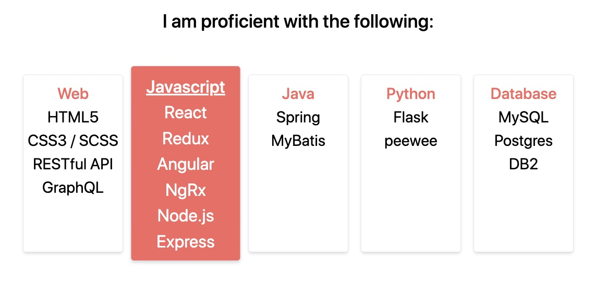

<!-- TODO: Add Blog Intro Picture that also serves for SEO Preview -->

Since diving deep into the world of Javascript frameworks in 2017, React was just one of those things that clicked and felt right.
I've dabbled in AngularJS, Angular 2+, as well as a little bit of Svelte, and still feel the most comfortable working in React. For that reason,
when I made it a goal to create a developer portfolio and blog platform, I went with React, specifically [Gatsby](https://www.gatsbyjs.org/).

## Why I Chose Gatsby

I started this project for numerous reasons which led me to choose Gatsby as my framework of choice.

1. Create a platform where I can showcase myself
2. Maximize learning opportunities by choosing technologies I haven't worked with
3. Choose a project that's large enough that I can iterate upon in the future

While playing around with ideas in my head, I settled on the idea to create a developer portfolio/blog. A portfolio and blog is large enough of a project that
will allow me to flex my creativity and knowledge, as well as give me a place to convey information that I've learned to the rest of the community.

After researching some React based frameworks, I landed on Gatsby for a couple of reasons.

1. Gatsby takes care of organizing your data through GraphQL
2. A static site generator that builds HTML during the build process will ensure a fast web app
3. Loads of plugins that tackle most major problems in web development such as routing and image processing
4. Amazing documentation for almost everything you'd need to learn on how to utilize the framework

### GraphQL

[GraphQL](https://graphql.org/) has been on the top of my list to learn and use since I've heard about it at the start of my frontend journey. 
A query language that gives you the flexibility of grabbing only the data that you need is a web developers dream! 

As a small example, a query would look like:
```javascript
{
    person {
        name
    }
}
```

Which produces JSON like this:
```javascript
{
    person: {
        name: "Andrew"
    }
}
```

Gatsby choice of using GraphQL for data related procedures allows for more benefits on top of what GraphQL offers such as:

* Keeping logical file paths
* Baked in image optimizations
* Easier context management for all data when using Gatsby `createPages`.
* Complex front end data manipulation can be done at build time.

For a detailed explanation on why Gatsby uses GraphQL, you can read it from them [here](https://www.gatsbyjs.org/docs/why-gatsby-uses-graphql/).

Currently, I am utilizing Gatsby and GraphQL to optimize the low amount of images on this platform utilizing the `gatsby-plugin-sharp` plugin, as well as dynamically 
generating the blog posts via Markdown with `gatsby-transformer-remark`. 

*I do plan to eventually swap over to using MDX instead as I would love the added benefit of utilizing JSX within Markdown.*

### Creating Blog Posts Dynamically With Markdown

I chose to dynamically generate blog posts via markdown as it was a simple and fast solution that would allow me to create posts easily. As a developer, I'm already pretty used
to markdown language as I use it with my team at work. Gatsby provide a very easy way to setup the usage of Markdown into web-ready 
content through a plugin called `gatsby-transformer-remark`. Below I'll go over my implementation.

There is a very well written guide from the Gatsby team [here](https://www.gatsbyjs.org/docs/adding-markdown-pages/) if you'd rather official documentation.

I first started with installing the plugins with npm and setting up the `gatsby-config.js` file. 

```
npm install --save gatsby-source-filesystem gatsby-transformer-remark
```
```javascript
module.exports = {
    plugins: [
        {
            resolve: `gatsby-source-filesystem`,
            options: {
                name: `posts`,
                path: `${__dirname}/src/posts`,
            },
        },
        `gatsby-transformer-remark`,
    ],
}
```

Then I created a posts folder, [you can see it here](https://github.com/andrewywoo/andrewywoo.github.io/tree/source/src/posts), under src which will hold the markdown files. 
I kept them in folders labeled by date but the naming convention is up to you. When providing `gatsby-source-filesystem` the path to this directory, the plugin helps source 
the Markdown files which can now be transformed to HTML and JSON to be queried via GraphQL.

In my markdown files I prefix the content with frontmatter data that can be queried via GraphQL.

```
---
slug: "build-with-gatsby-tailwind"
title: "Building My Platform With Gatsby And Tailwind"
date: "2020-07-04"
author: "@andrewywoo"
categories: "retrospect"
tags: "software engineer javascript"
---
```

Using Gatsby's Node.js `createPage` API, I can use GraphQL to query all Markdown file data and dynamically create pages using a template React component.

```javascript
exports.createPages = async ({ actions, graphql, reporter }) => {
    const { createPage } = actions

    const PostTemplate = require.resolve(
        "./src/templates/PostTemplate/index.jsx"
    )

    const result = await graphql(`
        {
            allMarkdownRemark {
                edges {
                    node {
                        html
                        id
                        frontmatter {
                            slug
                            title
                            author
                        }
                    }
                }
            }
        }
    `)

    if (result.errors) {
        reporter.panicOnBuild(`Error while running GraphQL query.`)
        return
    }

    result.data.allMarkdownRemark.edges.forEach(({ node }) => {
        const {
            frontmatter: { slug },
        } = node

        createPage({
            path: `/blog/${slug}/`,
            component: PostTemplate,
            context: {
                slug: slug,
            },
        })
    })
}

```

The next step was to set up a template for the actual blog page. [Click here](https://github.com/andrewywoo/andrewywoo.github.io/blob/source/src/templates/PostTemplate/index.jsx) 
for the full template code.

Inside `PostTemplate`, a query matches up the blog pages' slug (url) and grabs the content that should be displayed. The slug value is related to the slug that we passed
via context when calling Gatsby's createPage API above.

```graphql
export const query = graphql`
    query($slug: String!) {
        markdownRemark(frontmatter: { slug: { eq: $slug } }) {
            html
            frontmatter {
                title
                date(formatString: "dddd, MMMM Do YYYY")
                author
            }
        }
    }
`
```

This code is basically what drives the content you're reading right now! The only other tricky part about all this was that I am using Tailwind CSS to style my entire app.

### Styling My Application with Tailwind

[Tailwind CSS](https://tailwindcss.com/) was on my list of tools to learn since I've heard a lot about the lightweight approach to styling 
versus a heavier opinionated framework like [Bootstrap](https://getbootstrap.com/). What I mean when I say lightweight is that Tailwind provides low-level utility classes
that you can use to build custom designs but doesn't provide you with usable components like buttons, cards, and alerts. The utility classes really saves time on having to 
write common CSS that you usually write for things like Card components or Nav Bar styling.

### Implementation Specifics

Since I knew I wanted to use Tailwind for my CSS framework, I did a quick google search on Gatsby using Tailwind, and of course there's documentation already written! 
https://www.gatsbyjs.org/docs/tailwind-css/ 

Going back to the point on why I was creating a portfolio, to maximize learning opportunities by choosing technologies I haven't worked with, I chose the option to use Tailwind 
using CSS-in-JS and integrating it with Styled Components. If you're unfamiliar with CSS-in-JS, the main concept is having your styles live within the Javascript versus
writing CSS, SASS, or SCSS.

This might have been overly ambitious, but it was a lot of fun learning a bunch of things at once. And once the paradigm of styling components sinked in, I really enjoyed
working with styling this way. Here is a small example of using Tailwind classes with Styled Components:

For my homepage, I have a skills section on the bottom that repeats a couple of card like sections with technologies I've worked with. Using Styled Components, I styled a div using
tailwind css classes which you can see below:

```javascript
import tw, { styled } from "twin.macro"

const SkillsCard = styled.div`
    ${tw`border rounded-md shadow-md w-10/12 sm:w-48 m-3 py-3`}
    ${tw`transition duration-200 hover:transform hover:scale-110`}
    ${tw`hover:bg-red-500 hover:text-white`}
    &:hover {
        h3 {
            @apply ${tw`text-white underline`};
        }
    }
    `

render(){
    return (
        <SkillsCard>
            Information!
        </SkillsCard>
    )
}
```

This resulted with the following:


You can see the full `SkillsSection` code [here](https://github.com/andrewywoo/andrewywoo.github.io/blob/source/src/components/SkillsSection.jsx).

### Issues I Ran Into Using Tailwind

The main issue I ran into was Tailwind's use of [Preflight](https://tailwindcss.com/docs/preflight/). Preflight is a set of base styles that are 
designed to smooth out inconsistencies cross browser. These include default margins being removed from elements like headings, blockquotes, paragraphs,
and things like headings and lists being un-styled.

At first I was annoyed that I had to style all these elements myself, but after working with it I saw the benefits. These base styles help you style your components
the way that you want it to look without relying or, oftentimes, working around pre-existing styles. Things like headers should be visually de-emphasized so you can follow
A11y concepts and you can apply the styles consciously and deliberately.

While Preflight was great in designing the bulk of the site, I had an issue where Markdown was now missing default styling. I worked around this by creating a styled div
and using it as it's container for the markdown html. This created a global style that was utilized in all my blog posts.

```javascript
import tw, { styled } from "twin.macro"

export const BlogDiv = styled.div`
    ${tw`mx-12 w-full lg:w-9/12`}
    p {
        ${tw`mb-6`}
    }
    h2 {
        ${tw`text-3xl font-medium mb-6`}
    }
    h3 {
        ${tw`text-2xl mb-3`}
    }
    ul { 
        ${tw`list-disc list-inside mb-6`}
     }
     ol { 
        ${tw`list-decimal list-inside mb-6`}
     }
     ul ul, ol ul { 
         ${tw`list-circle list-inside ml-16`}
     }
     ol ol, ul ol { 
        ${tw`list-roman list-inside ml-16`}
     }
     ul p, ol p {
         ${tw`inline`}
     }
     pre {
         ${tw`mb-6`}
     }
     code {
         ${tw`text-sm`}
     }
     a {
         ${tw`underline hover:text-red-500`}
     }
`

<BlogDiv dangerouslySetInnerHTML={{ __html: html }} />
```

### Conclusion

All in all, I learned a ton of new technologies and strengthened my understanding of React by building this platform. I was able to tick off a lot of things on my list
of technologies to work with. As I free up time, I will also be able to iterate on this platform by adding new features which I'll also follow my main points of getting out
of using things I'm comfortable with. Of course I'll write self reflecting documentation similar to this one while I add new things.

The list of things I plan to add are ever-growing but here's a list of some items I'm planning on adding in the near future.

* Reactions to blog posts
* Working with Github Open API to polish up the personal work section on the `Work` page
* Dark mode toggle
* Robust filtering for `Blog` page

If you've made it down this far, I hope this post was informative and entertaining to read. I'll be trying to post on a regular cadence which will hopefully improve my content
writing over time. Feel free to reach out to me via the contact button below if you have any recommendations on what you'd want me to cover next. Also the code to this portfolio
is public and can be found [here](https://github.com/andrewywoo/andrewywoo.github.io).